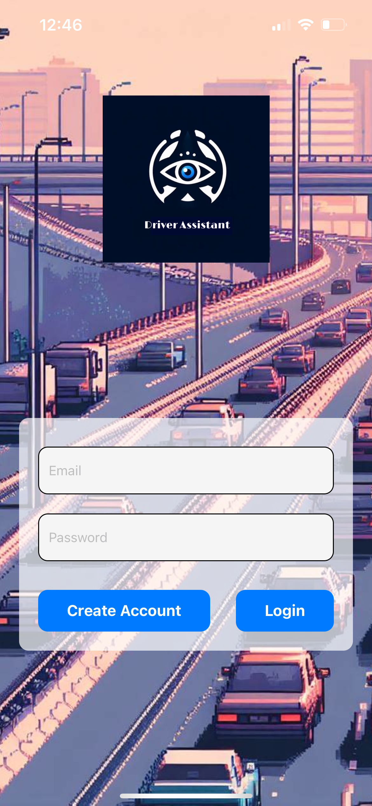
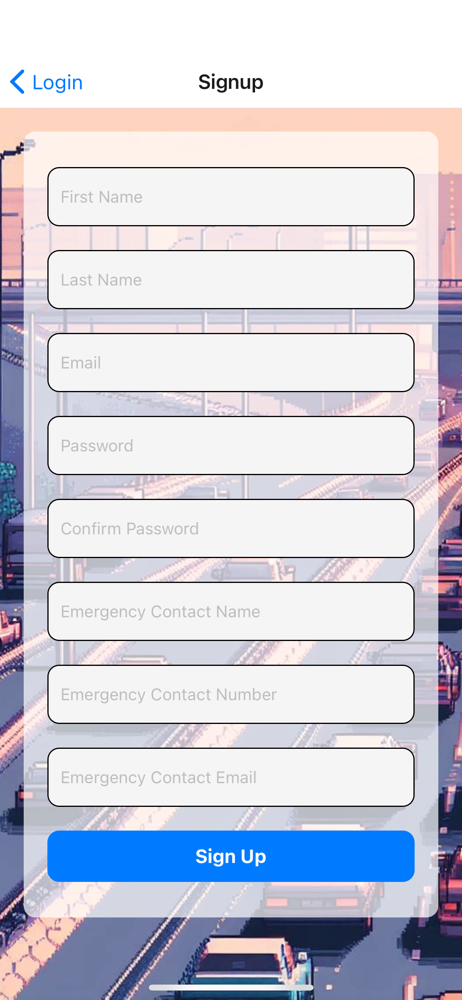
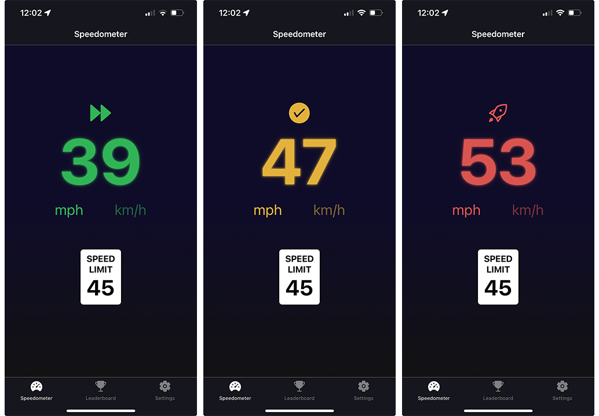
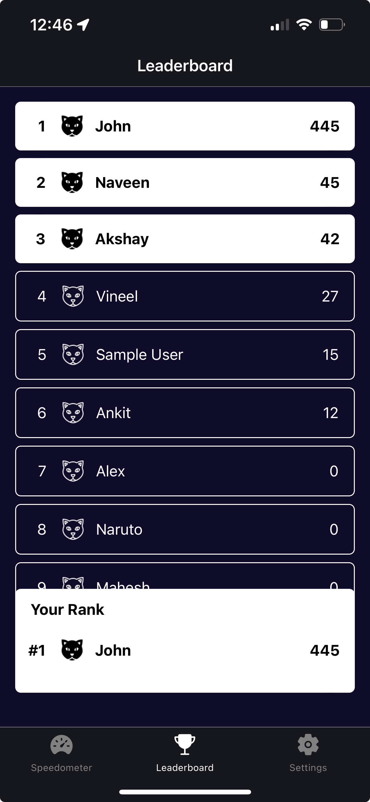
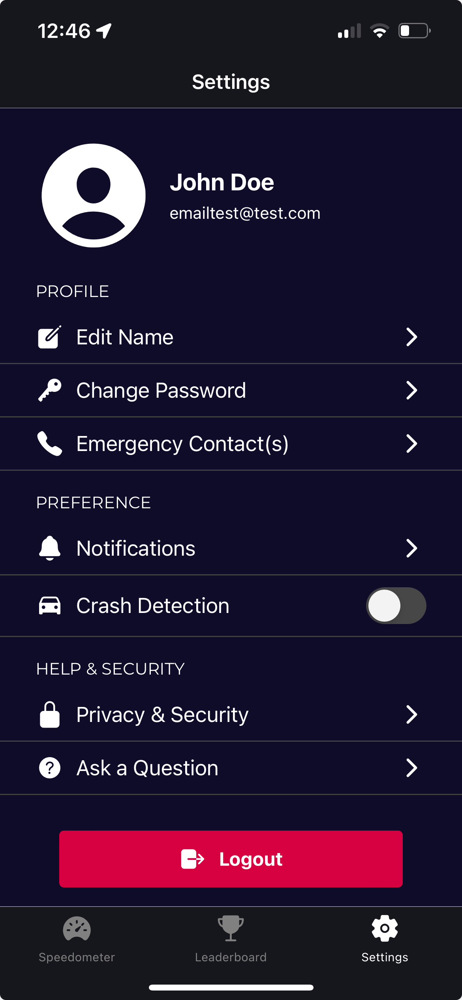

# Drive Safe - Smart Driver Assistant

Welcome to the Drive Safe project! This mobile application leverages smartphone sensor technologies to enhance road safety by monitoring driver behaviors in real-time. The application is designed to minimize distractions and promote safer driving practices through alerts and gamification.

## Features

- **Real-Time Speed Monitoring:** Utilizes GPS to display current speed and compare it with local speed limits.
- **Alerts:** Provides auditory alerts when the user exceeds speed limits.
- **Gamification:** Encourages safer driving practices by rewarding drivers with points for adhering to speed limits.
- **Crash Detection:** Detects potential crashes and alerts the emergency contacts.

## Installation

To run this application on your android device, follow the below steps:

1. Download the APK file for the application from this link: [Drive Safe APK](https://expo.dev//accounts/akola1/projects/Driver-Assistant-UI/builds/944c9d8d-aef5-4553-bbaa-8d9d88cc0d53)
2. Once the download is complete, navigate to the location where the APK file is saved on your Android device. 
3. Tap on the APK file to initiate the installation process.
4. Follow the on-screen prompts to complete the installation.
5. Once installed, you can open the app directly from your device's app drawer and start testing it.

## Development

This project is developed using Expo in React Native. It benefits from cross-platform compatibility and an array of pre-built components that expedite the development process.

### Prerequisites

- Node.js
- Expo CLI
- React Native

### Setting Up for Development

1. Clone the repository to your local machine.
2. Navigate to the project directory and run `npm install` to install dependencies.
3. Start the development server by running `npx expo start`.

## App Screenshots
### Login Page [Fig 1]

### Signup Page [Fig 2]

### Speedometer View [Fig 3]

### Leaderboard View [Fig 4]

### Settings View [Fig 5]

## User Manual

| Screen          | Features                                                                                                                                                                       | Reference  |
|-----------------|--------------------------------------------------------------------------------------------------------------------------------------------------------------------------------|------------|
| **Login Screen**| *Login Form:* The authentication form on the Login screen allows the drivers to input their email address and password for account access.                                      | [Fig 1]    |
|                 | *Invalid Credentials Prompt:* If login credentials are incorrect, an alert appears on the Login screen, notifying the user of the incorrect username or password.                  |            |
|                 | *Create Account:* If a driver is a first-time user, click this button to create an account. They will be prompted to fill in basic personal details.                            |            |
| **Signup Screen**| *First Name:* Drivers can input their first name here.                                                                                                                         | [Fig 2]    |
|                  | *Last Name:* This field is for entering the driver’s last name.                                                                                                                 |            |
|                  | *Email:* Drivers provide their email address, which will likely be used for account-related communication.                                                                       |            |
|                  | *Password:* Here, drivers set a password for their account. It’s essential for security.                                                                                        |            |
|                  | *Confirm Password:* To prevent typos or mistakes, drivers re-enter their chosen password.                                                                                        |            |
|                  | *Emergency Contact Name:* Drivers can specify the name of an emergency contact person.                                                                                           |            |
|                  | *Emergency Contact Number:* This field is for entering the phone number of the emergency contact.                                                                                |            |
|                  | *Emergency Contact Email:* If available, drivers can provide the email address of their emergency contact.                                                                       |            |
|                  | *Sign Up:* The blue button at the bottom allows drivers to submit their information and create an account.                                                                      |            |
| **Speedometer Screen**| *Speed Display:* A white box displays the speed limit of the current location.                                                                                                   | [Fig 3]    |
|                  | *Driver Speed:* The current speed as a driver is shown prominently in the middle of the screen which is a sponsor requirement feature. It is color-coded for quick reference:                                                          |            |
|                  |      *Red:* Exceeding speed limit                                                                                                                                             |            |
|                  |      *Green:* Within speed limit                                                                                                                                              |            |
|                  |      *Blue:* Under speeding                                                                                                                                                   |            |
|                  |      *Orange:* exceeds the speed limit but within 10 mph speed limit.                                                                                                         |            |
|                  | *Unit Conversion:* Drivers can swap between miles per hour (mph) and kilometers per hour (kph) for the speed values.                                                            |            |
| **Leaderboard Screen**| *Leaderboard:* The Leaderboard table provides a visual representation of driver performance based on points earned. The names of drivers alongside their corresponding points, are arranged in descending order from the highest to the lowest points. | [Fig 4] |
|                       | *Your Rank Section:* The current driver’s details are mentioned here that include their name, rank and points.                                                                  |            |
| **Settings Page**| *Edit Name:* This button allows the driver to modify their displayed name within the app. They can change it to something more fitting or update it if needed.                    | [Fig 5]    |
|                  | *Change Password:* Clicking this button enables the driver to update their account password. It’s essential for maintaining security and ensuring that only authorized users can access the account.                                      |            |
|                  | *Emergency Contact(s):* Here, the driver can add or edit emergency contacts. These contacts will be notified in case of an emergency situation, such as an accident or health issue. This is a sponsor requirement feature.                                    |            |
|                  | *Notifications:* Tapping this button takes the driver to a page where they can manage their notification preferences.                                                           |            |
|                  | *Privacy & Security:* This button provides access to account privacy and security settings, including data sharing, privacy controls, and account protection, as per sponsor requirements.                                                           |            |
|                  | *Ask a Question:* This button provides a shortcut for drivers to ask questions. It could connect them with customer support or direct them to an FAQ section where common queries are addressed.                                                     |            |
|                  | *Logout:* A sponsor required feature where drivers want to sign out of their account, this red button is where they’d do it. Logging out ensures that their account remains secure when they’re not actively using the app.                                                           |            |

## Video Presentation

The following video comprehensively showcases all the features of our application : [YouTube Link](https://youtu.be/AuJbi9JHxMk?si=TpSvX5cDROlfXag3)

## License

This project is licensed under the MIT License - see the LICENSE file for details.

## Acknowledgments

- Thanks to all the team members (Akshay Reddy Kola, Varshith Sriram Mandalapu, Gokul Subramanian, Hariraj Venkatesan, Venkata Sai Mohan Kumar Pallapothu, Harsha Vardhan Mupparaju) who have invested their time in improving this app.
- Heartfelt thanks to Dr. Nouh Alhindawi, our Course Instructor, for his invaluable guidance and support throughout the development of this project.
- We are also grateful to Dr. Pranut Jain, our Faculty Sponsor, for his insightful advice and encouragement.
- Appreciation goes out to James Smith, our Course TA, for his assistance and dedication in helping us navigate through various challenges during this course.
- Special thanks to Expo for providing the tools that make React Native development easier.
